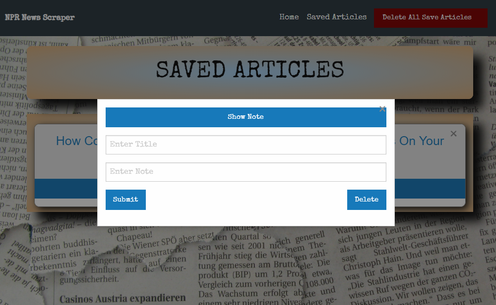

### ScrapperMongoDB
# All the News That's Fit to Scrape
Web app using Moongoose, Cheerio and MongoDB to provide you with the latest global news right at your finger tips. The source is from National Public Radio (NPR) and you have the ability to leave your thoughts, comments ir ideas in the note section. Enjoy!

Click here to visit the live website:
https://mongodb-scraper-jgoh.herokuapp.com/

## Table of Content
+ [Instructions](#instructions)
+ [Technologies Used](#tecnologies)
+ [Scraper Features](#features)
+ [Improvements](#improvements)
+ [creators](#contributors)

## <a name="instructions"> Instructions </a>
To get started you will need these applications:
+ [Node](https://nodejs.org/en/download/) 
+ [npm](https://docs.npmjs.com/cli/install)
+ [MongoDB](https://www.mongodb.com/download-center#community)

```
    npm install 

    install dependencies situated in package.json

    "dependencies": {
      "axios": "^0.19.2",
      "cheerio": "^1.0.0-rc.3",
      "express": "^4.17.1",
      "express-handlebars": "^3.1.0",
      "moment": "^2.24.0",
      "mongoose": "^5.9.2",
      "morgan": "^1.9.1"
    },
    "devDependencies": {
      "handlebars": "^4.5.0"
    }
```
## <a name="technologies"> Technologies Used </a>
* **Express** : Node.js web application framework
* **Express Handlebars** : handlebars view engine for Express
* **MongoDB** : database
* **Mongoose** : supports both promises and callbacks.
* **Cheerio** : parses markup and provides an API for traversing/manipulating the data structure.
* **axios** : promise based HTTP client for the browser and node.js

## <a name="features"> Scraper Features </a>
**Home Page** Home Page.


**Scrape News** To scrape news, click the "Get News!" button and this will retrieve the latest world news articles. You then have the options to retrive the artilce by cliking the link and this will take you to the article page. you can then go back to the home page to save the article for future reference. You can also add notes or comments to that article of interest.


**Save articel** - Saving article b clicking the save button.


**Saved Article Page** the article saved are populated in the save articcle page for easy reference.  


**Add Notes** clisking the "Add Note" button allow user to save or delete comments and notes to the server.  



## <a name="improvements"> Improvements </a>
* Work-in-progress to add authentication etc.
* Refine and broaden the scrape functionality
* opportunity to simplify the codes further

## <a name="contributors"> Contributor: </a><br />
* James Goh - https://github.com/jgohbb
